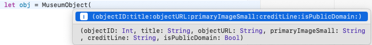

```metadata
ref: "02"
description_md: |
  Learn how to define structs and classes to model your app's data, along with some of the differences between these two custom types.
short_description: |
  Learn how to define structs and classes to model your app's data, along with some of the differences between these two custom types.
authors_notes_md: |

```

Use `$[//]` anywhere on the line to omit the line from transcript.

# Lesson 2: Structs & Classes

You're about to define a `MuseumObject` type for your MetMuseum app. In this demo, I'm using an Xcode playground and writing in Swift. If you're following along, start up Xcode and open the **module1-lesson2** playground in the starter folder. 

It has a `MuseumObject` struct that you'll fill in and a `showImage()` method stub. 

There's a commented-out initializer that you'll need later and a `MuseumObjectView` that `showImage()` will use to display the art object's image.

First, declare the properties your app will use:

```swift
let objectID: Int
let title: String
let objectURL: String
let primaryImageSmall: String
let creditLine: String
let isPublicDomain: Bool
```

Each instance of `MuseumObject` will have values for these properties. As you develop your app, you might need to add more properties, but these are enough for now. 

`MuseumObject` now has all the properties that `MuseumObjectView` uses, so go ahead and uncomment it.

### Instantiating Objects `$[//]`

A struct definition is just a template for objects. It doesn't do anything on its own. You have to **instantiate** an object — initialize it with parameter values

`$[//]` indicate `let object: MuseumObject` in `struct MuseumObjectView`
or pass it in as a parameter — 
`$[//]` indicate `object.title` and `object.primaryImageSmall`
and then your app can use the properties of each object, 
`$[//]` indicate `showImage()` stub
and each object can call `showImage()`.

So, instantiate two objects — one in the public domain and the other not in the public domain. Copy this code from the transcript below this video:

`$[//]` delete footage where I select this from my clipboard-keeper app

```swift
let object_pd =
MuseumObject(objectID: 436535,
             title: "Wheat Field with Cypresses",
             objectURL: "https://www.metmuseum.org/art/collection/search/436535",
             primaryImageSmall: "https://images.metmuseum.org/CRDImages/ep/original/DT1567.jpg",
             creditLine: "Purchase, The Annenberg Foundation Gift, 1993",
             isPublicDomain: true)
let object =
MuseumObject(objectID: 13061,
             title: "Cypress and Poppies",
             objectURL: "https://www.metmuseum.org/art/collection/search/13061",
             primaryImageSmall: "",
             creditLine: "Gift of Iola Stetson Haverstick, 1982",
             isPublicDomain: false)
```

You've created two instances of the `MuseumObject` type, each representing different art objects. These instances are initialized with specific property values, which will be used when working with the data of these art objects. 

### (Auto-)Defining init `$[//]`

With this set of properties, **struct** is a good choice for `MuseumObject`: All the properties are constant, and you're not currently planning to implement any method that changes any values. Swift even defines the `init` method for structs, so you don't have to. If you typed all the previous code instead of copy-pasting, you've seen this in practice. If not, try it now — start typing a new object creation:

```swift
let obj = MuseumObject(
```

 `$[//]`

You get a suggested auto-completion with an argument for each property, in the same order that you declared them.

Delete this line.

Now, suppose you decide to change `MuseumObject` to a class. Do this now:

```swift
class MuseumObject {
  ...
}
```

The playground flags an error. If yours is thinking about it for too long, click **run**.

The 'MuseumObject' class has no initializers. For a class, you need to define the `init()` method, so uncomment this code and add all your parameters:

```swift
init(objectID: Int,
     title: String,
     objectURL: String,
     primaryImageSmall: String,
     creditLine: String,
     isPublicDomain: Bool) {
  self.objectID = objectID
  self.title = title
  self.objectURL = objectURL
  self.primaryImageSmall = primaryImageSmall
  self.creditLine = creditLine
  self.isPublicDomain = isPublicDomain
}
```

You use `self` to differentiate the object's properties from the parameter values. The arguments are in the same order as the property declarations, but that's only so you don't have to change the instantiations you already wrote.

### Implementing `showImage()` `$[//]`

Now, implement `showImage()`:

```swift
if isPublicDomain {
  PlaygroundPage.current.setLiveView(MuseumObjectView(object: self))
} else {
  guard let url = URL(string: objectURL) else { return }
  PlaygroundPage.current.liveView = SFSafariViewController(url: url)
}
```

`$[//]` indicate first `MuseumObjectView` then `SFSafariViewController`
In a playground, you can either set the live view to a view, or to a view controller.

`$[//]` indicate `AsyncImage` then `import SafariServices`
`MuseumObjectView` uses `AsyncImage(url:)` to download and display `primaryImagesmall`. `SFSafariViewController`, which you get by importing `SafariServices`, loads `objectURL` into an embedded Safari browser.

### Calling `showImage()` `$[//]`

Now finally, each object can call `showImage()`. First, show the public domain image:

```swift
object_pd.showImage()
```

Run the playground. If nothing appears in _your_ playground, stop it and run it again.

") `$[//]`

`object_pd` is in the public domain, so `showImage()` sets the playground's live view to `MuseumObjectView`.

Now, stop the playground, comment out the line `object_pd.showImage()` and add this one:

```swift
object.showImage()
```

Run the playground again:

") `$[//]`

This time, `object` is not in the public domain, so `showImage()` loads its web page in a Safari browser.

### Other Differences `$[//]`

Structs and classes have other differences:

1. You can create subclasses of a class. This is **inheritance**, and it's a topic in the next lesson.  
2. Structs are value types; classes are reference types.
3. If a struct method modifies a struct object, you must mark it as `mutating`.

To demonstrate the second and third differences, change `title` to be variable:

```swift
var title: String
```

Also, change `MuseumObject` back to a struct:

```swift
struct MuseumObject {
```

Then, scroll down and add these lines below the `object_pd` instantiation:

```swift
var object2 = object_pd
object2.title = "Sunflowers"
```

Comment out `object.showImage()` and uncomment `object_pd.showImage()`, then run the playground. 

Because `MuseumObject` is a **struct**, `MuseumObjectView` still displays the title _Wheat Field with Cypresses_ because `object2` is a copy of `object_pd`: Changing `object2.title` doesn't affect `object_pd.title`.

What happens when `MuseumObject` is a class?

```swift
class MuseumObject {
```

Run the playground again.

Now that `MuseumObject` is a **class**, `MuseumObjectView` displays the title _Sunflowers_ because `object2` is the _same object_ as `object_pd`: Changing `object2.title` changes `object_pd.title`. 

When `MuseumObject` is a class, changing `object2`'s `title` works even if you declare it as a _constant_ class object:

```swift
let object2 = object_pd
```

because the constant value is its _location in memory_, not its contents.

`$[//]` this isn't in my placeholder narration; it goes just before running the playground again.
Run the playground again to confirm this.

Now, add this method to `MuseumObject`:

```swift
func changeTitle(to newTitle: String) {
  title = newTitle
}
```

And change `object2.title = "Sunflowers"` to this:

```swift
object2.changeTitle(to: "Sunflowers")
```
 
When `MuseumObject` is a **class**, this works the same as before.

Change `MuseumObject` back to a **struct**.

`$[//]` delete the long pause before I scroll down to see the error message

you get this error on `title = newTitle`:

> Cannot assign to property: 'self' is immutable

Fix this by marking `changeTitle` as `mutating`:

```swift
mutating func changeTitle(to newTitle: String) {
```

The error goes away. Why do you need to tell the compiler this method _mutates_ the struct object? 

`$[//]` delete the misspoken "if you had declared ..."
Well, when you declare `object2 ` as a _constant_ struct object — `let object2 = object_pd` — then _every property_ in that struct object is constant. You mark `changeTitle(to:)` as `mutating` so Swift knows that a constant struct object isn't allowed to call it.

When you change `let` to `var`, the error goes away.

Now, change `MuseumObject` to a class again. You get an error on `mutating`: _'mutating' is not valid on instance methods in classes_. So `mutating` really sets structs apart from classes.

Change `MuseumObject` back to a struct. You want `object2 ` to be a _copy_ of `object_pd` for this next line of code.

Add this line and comment out the other two `showImage()` lines:

```swift
object2 .showImage()
```

Run the playground:

") `$[//]`

And here's the changed title for this _copy_ of `object_pd`.

### One Last Thing `$[//]`

Sometimes, you want to hide some of your object's properties so they're only visible within the struct or class. This prevents "outside" code from using or modifying these values. For example, set `isPublicDomain` to be `private`:

```swift
private let isPublicDomain: Bool
```

Making this property `private` doesn't prevent `showImage()` from using it. But try typing this outside the struct:

```swift
if object.isPublicDomain { }
```

The first thing you'll notice: `isPublicDomain` doesn't show up in the auto-completion suggestions. There's also an error message (click the **run** button if you don't see it):

> 'isPublicDomain' is inaccessible due to 'private' protection level

Delete the `if ...` line and run the playground: There's no problem passing a value to `isPublicDomain` in the initializer. 

Comment out the `init` method and run the playground — there's an error message!

> 'MuseumObject' initializer is inaccessible due to 'private' protection level

The auto-generated struct initializer doesn't allow access to the `private` property but if you write your own, it's OK.

That ends this demo. Continue with the lesson for a summary.

